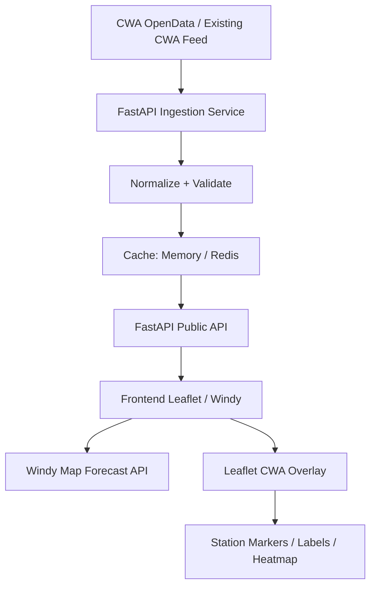

# Design: CWA Temperature Broadcast Visualization with Windy API

## 1. Project Overview

This project visualizes Taiwan CWA temperature broadcast / observation data on top of a Windy weather map.

The system uses:

* **CWA OpenData** as the trusted weather observation source.
* **FastAPI** as the backend API and data-normalization layer.
* **Windy Map Forecast API** as the interactive weather-map background.
* **Leaflet overlay layers** to render custom CWA temperature data on top of Windy.

Windy’s Map Forecast API is based on Leaflet 1.4.x, and Windy’s own documentation states that the Windy map object is a Leaflet map instance. This means we can use normal Leaflet features to draw our own CWA markers, labels, popups, and heatmap layers on top of the Windy map.

---

## 2. Goal

Build a real-time or near-real-time Taiwan temperature visualization system.

The first version should support:

1. Displaying a Windy map centered on Taiwan.
2. Loading latest CWA temperature observations from backend API.
3. Drawing CWA station temperatures as colored map markers.
4. Showing station name, county, town, temperature, humidity, wind, and observation time in popups.
5. Refreshing data automatically.
6. Providing a simple legend for temperature color ranges.
7. Allowing the user to switch Windy background layers, such as wind, rain, clouds, or temperature.

---

## 3. Why Windy + Leaflet

Windy should be treated as the **weather context layer**, not as the storage or rendering engine for our CWA data.

Windy gives us:

* Professional-looking weather-map background.
* Built-in weather overlays.
* Map controls.
* Forecast/weather context.
* Wind, rain, cloud, and temperature model layers.

Leaflet gives us:

* Custom station markers.
* Custom CWA temperature labels.
* Popups.
* GeoJSON support.
* Layer groups.
* Future heatmap or canvas overlays.

---

## 4. Data Source

### 4.1 CWA Observation Data

The CWA automatic weather station dataset includes fields such as:
* `StationName`
* `StationId`
* `DateTime`
* `StationLatitude`
* `StationLongitude`
* `StationAltitude`
* `CountyName`
* `TownName`
* `Weather`
* `Precipitation`
* `WindDirection`
* `WindSpeed`
* `AirTemperature`
* `RelativeHumidity`
* `AirPressure`
* `PeakGustSpeed`

---

## 5. Architecture

---

## 6. Recommended Tech Stack

### Backend
* Python 3.10+
* FastAPI
* httpx
* Pydantic
* Uvicorn

### Frontend
* Modern Responsive Web Dashboard (HTML5, Vanilla CSS3, ES Modules)
* Windy Map Forecast API
* Leaflet 1.4.0
